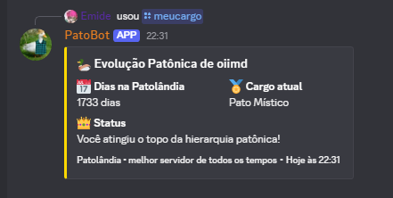
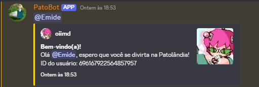
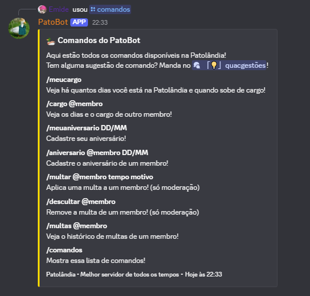

<div align="center">
  <h1>🦆 PatoBot</h1>
  <p>Bot oficial da Patolândia</p>

  
  
  
  
  
</div>

---

## Sobre

O PatoBot foi criado para o servidor **Patolândia**, um servidor Discord temático de patos. Ele automatiza tarefas que antes eram feitas manualmente, como atualização de cargos por tempo de servidor, mensagens de boas-vindas, sistema de moderação e parabenização de aniversariantes com mensagens geradas por IA.

> ⚠️ Este bot foi desenvolvido para uso exclusivo da Patolândia. Para adaptar ao seu servidor, será necessário modificar as variáveis de ambiente, IDs de cargos e canais.

## Funcionalidades

- **Evolução Patônica** — atualiza cargos automaticamente baseado no tempo que o membro está no servidor, verificando diariamente
- **Boas-vindas** — manda mensagem personalizada quando alguém entra no servidor e atribui o cargo inicial automaticamente
- **Aniversários** — membros cadastram seu aniversário e o bot parabeniza com mensagem gerada por IA no dia
- **Sistema de multas** — moderadores podem multar membros por tempo determinado, com hierarquia de permissões por cargo e remoção automática ao expirar
- **Comandos slash** — interface moderna com `/meucargo`, `/cargo`, `/multar`, `/descultar`, `/multas`, `/meuaniversario`, `/aniversario` e `/comandos`

## Screenshots

<div align="center">
  
  <br/><br/>
  
  <br/><br/>
  
</div>

## Tecnologias

- [Node.js](https://nodejs.org)
- [Discord.js v14](https://discord.js.org)
- [Sequelize](https://sequelize.org) + [PostgreSQL](https://www.postgresql.org)
- [node-cron](https://github.com/node-cron/node-cron)
- [Groq API](https://groq.com)
- [Oracle Cloud](https://www.oracle.com/cloud/free/) — hospedagem gratuita

## Como rodar localmente

**Pré-requisitos:** Node.js 18+, PostgreSQL

**1. Clone o repositório**
```bash
git clone https://github.com/emilainezx/patobot.git
cd patobot
```

**2. Instale as dependências**
```bash
npm install
```

**3. Configure o `.env`**
```env
BOT_TOKEN=
GUILD_ID=
DATABASE_URL=
GROQ_API_KEY=

WELCOME_CHANNEL_ID=
ANIVERSARIO_CHANNEL_ID=
COMANDOS_CHANNEL_ID=

FILHOTE_ROLE_ID=
MUTED_ROLE_ID=
PRESIDENTE_ID=
MINISTRO_ID=
SENADOR_ID=
DEPUTADO_ID=
NETO_ID=
```

**4. Rode o bot**
```bash
node src/index.js
```

## Estrutura do projeto

```
src/
├── discord/commands/
│   ├── moderacao/     # multar, descultar, multas
│   ├── patolandia/    # cargo, meucargo, aniversario, meuaniversario, neto
│   └── util/          # comandos
├── events/            # ready, guildMemberAdd, interactionCreate
├── functions/         # gerarMensagemAniversario, getTemposPermitidos
├── jobs/              # dailyJobs
├── constants.js
├── database.js
├── roleScheduler.js
└── index.js
```
## Licença

MIT © [Emilaine Bernardo](https://github.com/emilainezx)